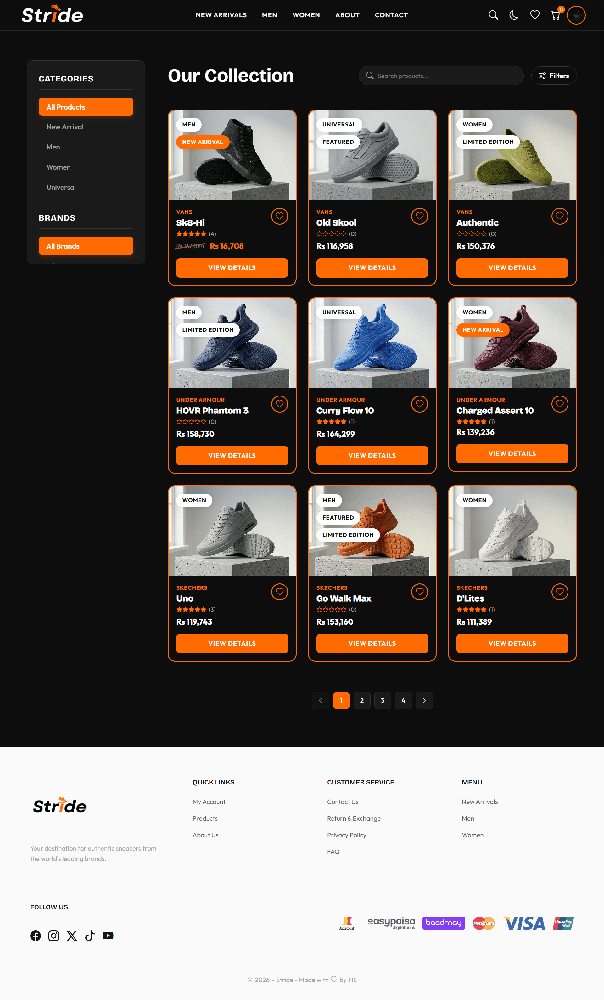
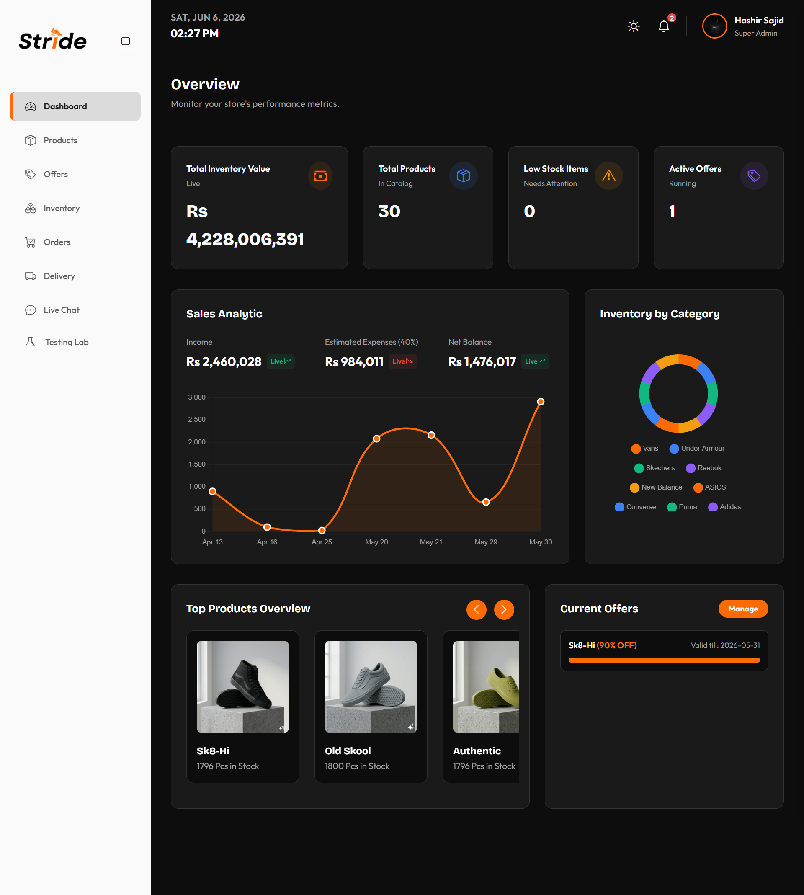
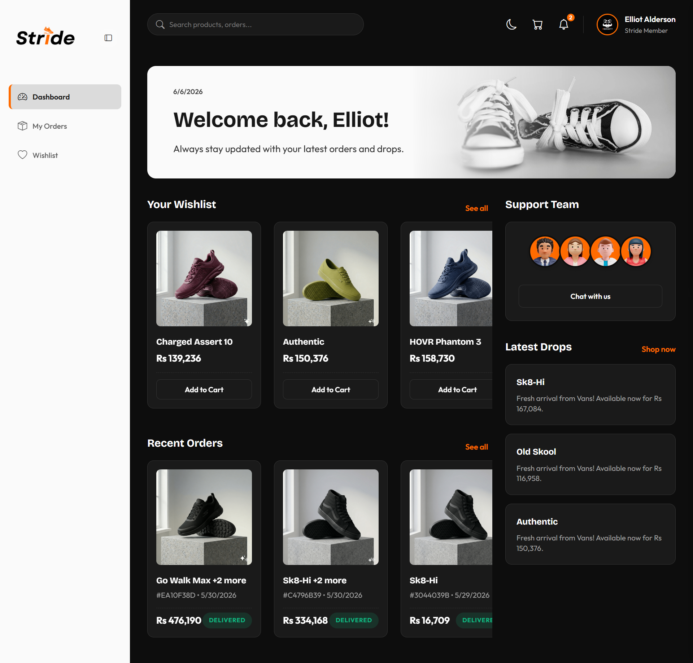

# 👟 Stride — Full Stack Footwear E-Commerce

Stride is a premium full-stack footwear e-commerce platform featuring dynamic, cognitive capabilities and advanced admin controls. It solves the limitations of traditional retail sites by integrating high-dimensional semantic search, a context-aware customer chatbot, automatic currency localization, and weather-aware delivery tracking. The platform delivers a high-performance shopping experience with a clean design aesthetic and responsive interface. 

<p align="left">
  <em>This project was developed as a Final Year Project (FYP).</em>
</p>
---

## 🌐 Live Demo

🔗 [View Stride](https://stride-full-stack.vercel.app/)

---

## 👀 Previews

### 🏠 Home Page


### 🛍️ Product Page


### 🛡️ Admin Dashboard


### 👤 User Dashboard


---

## ✨ Features

### 🛍️ Shopping Experience
- **Responsive Layout**: Designed from modern UI mockups with fluid Vanilla CSS, light/dark layout toggles, custom interactive scroll controls, and skeleton animation states.
- **Dynamic Product Detail Page**: Implements color-block swatch variants, size matrix grids, and image zoom panels.
- **Multi-Currency Localizer**: Recognizes client location by IP addresses to execute dynamic currency conversion (supporting USD, EUR, GBP, PKR, etc.) using live exchange rates.
- **Custom Checkout Journey**: Persists shopping cart state locally, validates valid coupons and active flash discounts, and processes payments via Stripe checkout elements.

### 🧠 Cognitive Capabilities
- **Semantic Product Search**: Resolves search parameters using high-dimensional text embeddings (`text-embedding-004` from Gemini or local Xenova fallbacks) to match database products using cosine distance similarity.
- **RAG Customer Support Chatbot**: Reads past user order data and semantic product matches to populate custom LLM system prompts, streaming responses in real-time using Server-Sent Events (SSE).
- **Smart Logistics Officer**: Locates shipping addresses, queries local weather details (extreme rain, snow, temperature thresholds), and prompts LLaMA 3.1 to generate weather-aware, context-aware shipping summaries.

### 🔐 Authentication & User Accounts
- **Firebase Authentication**: Secures signup, login, password reset, and session tracking using JWT token exchanges.
- **Customer Dashboard**: Displays past orders, provides item shipping status tracking updates, and houses account info controls (including account deletion).

### 🛡️ Super Admin Control Panel
- **Real-Time Analytics Dashboard**: Displays total store sales revenue logs (Line Charts) and item variant stock distributions (Doughnut Charts) using Chart.js.
- **Variant Product Creator**: Houses forms to map footwear metadata, upload images straight to Cloudinary, assign variant colors, and build size matrices.
- **Bulk Inventory Restocker**: Serves a spreadsheet interface to update quantities of sizes 7 to 12 across products simultaneously.
- **Promotional Planner**: Configures discount coupon thresholds and launches global flash sales.
- **WebSocket Live Support Desk**: Allows admins to join user chatrooms and reply directly using real-time Socket.io connections.
- **Sandbox Testing Lab**: Allows testing flags (e.g., enable/disable checkout, chatbot, reviews, and content protection modules which lock right-clicks and drag actions on images/videos).

---

## 🛠️ Tech Stack

### Frontend (Client)
| Technology | Purpose |
|------------|---------|
| **React 19** | Core SPA framework for building the reactive UI |
| **Vite** | Tooling and high-performance development server |
| **Vanilla CSS / CSS Modules** | Custom styles, layout variables, and page transitions |
| **React Router DOM v7** | Client-side routing engine |
| **Firebase Client SDK** | Secure credentials-based authentication |
| **Socket.io Client** | Real-time live support desk connection |
| **Supabase Client SDK** | Direct database read integrations |

### Backend (Server)
| Technology | Purpose |
|------------|---------|
| **Node.js & Express** | RESTful routing and server-side logic middleware |
| **Socket.io** | Bidirectional communication server-side gateway |
| **Firebase Admin SDK** | Backend validation for client JWT auth tokens |
| **Stripe SDK** | Secure credit card transaction sessions |
| **Cloudinary SDK** | Automated media uploading and deletion |
| **Resend SDK** | Contact form routing and newsletter updates |
| **Google Generative AI SDK** | Gemini `text-embedding-004` embedding creator |
| **Xenova Transformers** | Local execution fallback for embeddings generation |

### Database & Infrastructure
| Technology | Purpose |
|------------|---------|
| **Supabase (PostgreSQL)** | Persistent relational database engine |
| **pgvector** | Vector similarity database extension |
| **Vercel** | Unified deployment hosting (Client and Serverless APIs) |

---

## 📁 Project Structure

```
stride-full-stack/
├── client/                  # Vite + React frontend
│   ├── public/              # Static media assets, logos, and videos
│   ├── src/                 # React source code
│   │   ├── components/      # Shared components (Layout, UI, Admin, ECommerce)
│   │   ├── context/         # React Context files (Cart, Currency, Offer)
│   │   ├── pages/           # Client views (Home, Products, Admin/User Dashboards)
│   │   ├── utils/           # API and configurations resolver
│   │   ├── App.jsx          # Route router config
│   │   ├── firebaseConfig.js# Firebase client SDK script
│   │   ├── index.css        # Global variables and resets
│   │   └── main.jsx         # App entry point
│   ├── package.json         # Client dependencies & scripts
│   └── vite.config.js       # Vite bundler parameters
├── server/                  # Node.js + Express backend
│   ├── config/              # Server configuration (Firebase Admin SDK)
│   ├── controllers/         # Logic handlers for endpoints
│   ├── routes/              # Express API endpoint definitions
│   ├── scripts/             # Database embedding generator scripts
│   ├── services/            # Embedding generation layer (Gemini/Xenova)
│   ├── check_dim.js         # Embedding testing tool
│   ├── check_schema.js      # Supabase connection testing tool
│   ├── server.js            # Express server configuration
│   └── package.json         # Server dependencies & scripts
├── vercel.json              # Vercel deployment config
└── README.md                # Project documentation
```

---

## 🔌 API Endpoints

### Auth Routes
| Method | Endpoint | Description |
|--------|----------|-------------|
| `POST` | `/api/auth/verify` | Validates Firebase client ID tokens on requests |

### Product Routes
| Method | Endpoint | Description |
|--------|----------|-------------|
| `POST` | `/api/products/search-semantic` | Queries products using high-dimensional cosine similarity |
| `POST` | `/api/products/sync-embedding/:id` | Generates and updates the vector embedding for a database product |

### Payment Routes
| Method | Endpoint | Description |
|--------|----------|-------------|
| `POST` | `/api/payments/create-checkout-session` | Generates secure Stripe Checkout sessions for cart items |

### Currency Routes
| Method | Endpoint | Description |
|--------|----------|-------------|
| `GET` | `/api/currency` | Retrieves current exchange rates for currency mapping |
| `GET` | `/api/currency/detect-ip` | Geolocates IP to return localized currency settings |

### AI Logistics Routes
| Method | Endpoint | Description |
|--------|----------|-------------|
| `POST` | `/api/ai/track-order` | Compiles custom weather-aware delivery alerts using LLaMA 3.1 |

### Chat Routes
| Method | Endpoint | Description |
|--------|----------|-------------|
| `POST` | `/api/chat/ask` | Initiates SSE streaming RAG chatbot support completions |

### Utility & Global Actions (Root Server Routes)
| Method | Endpoint | Description |
|--------|----------|-------------|
| `POST` | `/api/newsletter/subscribe` | Adds email to newsletter subscription logs |
| `POST` | `/api/contact` | Sends contact form message details to admin support |
| `GET` | `/api/config` | Dynamically fetches frontend credentials configurations |
| `POST` | `/api/images/delete` | Deletes uploaded image asset from Cloudinary |
| `GET` | `/` | Checks Express API server status |

---

## 🗄️ Database Schema

The database uses PostgreSQL on Supabase with the `pgvector` extension enabled.

### `products` Table
- `id` — text (Primary Key) — Unique product code
- `brand` — text (Not Null) — Shoe brand name
- `name` — text (Not Null) — Footwear model name
- `description` — text — In-depth description details
- `price` — numeric (Not Null) — Cost of item in USD
- `tags` — text — Descriptors for searching/filtering
- `main_image_url` — text (Not Null) — Main image URL
- `embedding` — vector (384/768 dimensions) — Vector embedding of product details
- `created_at` — timestamp — Catalog date record creation

### `product_colors` Table
- `id` — bigint (Primary Key, Auto-increment)
- `product_id` — text (Foreign Key -> `products.id` ON DELETE CASCADE) — Associated product
- `color_name` — text (Not Null) — Shade name description
- `image_url` — text (Not Null) — Cloudinary URL for variant

### `product_sizes` Table
- `id` — bigint (Primary Key, Auto-increment)
- `product_id` — text (Foreign Key -> `products.id` ON DELETE CASCADE) — Associated product
- `size` — numeric (Not Null) — UK/US shoe size
- `stock_quantity` — integer (Not Null) — Available inventory count

### `orders` Table
- `id` — text (Primary Key) — Order reference code
- `created_at` — timestamp — Date order was processed
- `full_name` — text (Not Null) — Recipient name
- `email` — text (Not Null) — Contact email
- `phone` — text — Shipping phone number
- `address` — text (Not Null) — Shipping address
- `postal_code` — text — Zipcode details
- `items` — json (Not Null) — List array of purchased variants details
- `total_amount` — numeric (Not Null) — Final order sum in USD
- `status` — text — Order progression: 'Pending', 'Processing', 'Shipped', 'Delivered', 'Cancelled'
- `is_manual_override` — boolean — Keeps admin state static without time-based automation override

### `delivery_options` Table
- `id` — text (Primary Key) — Shipping tier code
- `name` — text (Not Null) — Shipping tier name
- `cost` — numeric (Not Null) — Shipping charge in USD
- `is_free` — boolean — Free delivery criteria flag
- `time` — text — Estimated duration details

### `offers` Table
- `id` — bigint (Primary Key, Auto-increment)
- `type` — text (Not Null) — Offer tier ('coupon' or 'flash')
- `code` — text (Unique) — Promo coupon text
- `discount_percentage` — integer (Not Null) — Discount percent (1-100%)
- `target_product_id` — text (Foreign Key -> `products.id` ON DELETE CASCADE) — Scope limit
- `valid_until` — date — Promo expiration limit
- `limit` — integer — Remaining claims count

### `platform_notifications` Table
- `id` — bigint (Primary Key, Auto-increment)
- `type` — text (Not Null) — Alert category type
- `title` — text (Not Null) — Brief header
- `message` — text (Not Null) — Detailed description content
- `related_id` — text — Reference key to related product/order/offer
- `is_read` — boolean — Read state flag
- `created_at` — timestamp — Notification dispatch timestamp

### `reviews` Table
- `id` — bigint (Primary Key, Auto-increment)
- `product_id` — text (Foreign Key -> `products.id` ON DELETE CASCADE) — Associated product
- `user_id` — text (Not Null) — Firebase user ID
- `user_name` — text — Display name of user
- `rating` — integer — Star count rating (1 to 5)
- `text` — text — Written review details
- `created_at` — timestamp — Submission date

### `chat_messages` Table
- `id` — bigint (Primary Key, Auto-increment)
- `user_id` — text (Not Null) — Firebase user ID or active session code
- `user_name` — text — Customer name
- `text` — text (Not Null) — Chat dialogue message
- `sender` — text (Not Null) — Message author type ('user', 'admin', 'ai')
- `created_at` — timestamp — Delivery timestamp

---

