# Software Requirements Specification (SRS)
## Project: Stride (Premium Footwear E-Commerce Platform)

---

## 1. Introduction

### 1.1 Purpose
This document specifies the Software Requirements Specification (SRS) for the **Stride** e-commerce platform. It outlines the functional and non-functional requirements, external interfaces, system architecture constraints, and data requirements proposed prior to the development of the website and server.

### 1.2 Document Conventions
This document adheres to the IEEE 830-1998 standard conventions for SRS documentation. Critical requirements, security measures, and third-party integrations are highlighted using warning and note panels.

### 1.3 Intended Audience
This specification is designed for:
- **Developers** as an implementation guide.
- **Project Supervisors/Evaluators** for academic grading and scope verification.
- **QA Engineers** to draft manual and automated validation test suites.

### 1.4 Product Scope
Stride is a premium, full-stack footwear e-commerce platform designed to combine modern shopping paradigms with intelligent customer support systems. The platform will deliver:
1. A highly responsive, visual-first catalog with instant server-driven dynamic updates.
2. A secure checkout environment utilizing Stripe Payments.
3. An administrative control panel (Super Admin Dashboard) for direct store oversight.
4. An automated Customer Support Chatbot powered by LLMs (Large Language Models) leveraging semantic vector search to answer inventory and order questions.
5. An AI-driven Smart Logistics Officer capable of delivering weather-aware delivery notifications to customers.

---

## 2. Overall Description

### 2.1 Product Perspective
Stride acts as a self-contained web platform comprising a client application (built with React) and a backend application (built with Express on Node.js). It integrates with Firebase Authentication for identity management, Supabase (PostgreSQL) for transactional database records, Stripe for payment processing, Cloudinary for asset hosting, and external AI models (Gemini & Groq) for smart capabilities.

### 2.2 Product Functions
The high-level capabilities planned for the platform are organized as follows:

```mermaid
graph TD
    User([Customer]) --> Catalog[Browse & Search Catalog]
    User --> Cart[Manage Cart & Checkout]
    User --> Track[Smart Weather-Aware Tracking]
    User --> Chat[AI Support Chatbot]
    User --> Profile[Update Profile & History]
    
    Admin([Super Admin]) --> ProdMgt[Product CRUD & Color/Size Variant Builder]
    Admin --> InvMgt[Bulk Inventory Restocking]
    Admin --> PromoMgt[Coupons & Flash Sales Manager]
    Admin --> DeliverMgt[Shipping Methods & Cost Controller]
    Admin --> LiveChat[WebSocket Admin-to-User Realtime Chat]
    Admin --> Sandbox[Testing Lab Configuration Panel]
```

### 2.3 User Classes and Characteristics
*   **Guest Customer**: Unauthenticated users who can browse products, search items semantically, and add products to their carts.
*   **Registered Customer**: Authenticated users who can persist their cart, checkout using Stripe, track active orders, post reviews, and interact with the AI assistant.
*   **Super Admin**: Elevated administrative accounts with access to catalog controls, database CRUD functions, live websocket chat, notifications, and sandbox controls.

### 2.4 Operating Environment
*   **Client**: Modern web browsers (Chrome 100+, Firefox 100+, Safari 15+, Edge 100+).
*   **Server Host**: Node.js v18+ runtime environment.
*   **Database**: PostgreSQL 15+ database instance (hosted on Supabase) with the `pgvector` extension enabled.

### 2.5 Design and Implementation Constraints
1. **No Local Media Storage**: All product images and avatars must be offloaded to Cloudinary.
2. **Payment Compliance**: Stripe elements must capture payments directly; no raw credit card numbers are to be sent through or stored in the database.
3. **Vanilla CSS Styling**: UI styling must use standard Vanilla CSS and CSS Modules to ensure exact control over modern visual tokens (glassmorphism, variables, grid scaling).

---

## 3. System Features (Functional Requirements)

### 3.1 User Authentication & Profile Module
*   **Description**: Users must be able to sign up, sign in, reset passwords, update their details, and delete their accounts.
*   **Requirements**:
    *   Integrate Firebase Authentication on the frontend.
    *   Verify tokens on the backend using the Firebase Admin SDK.
    *   Store profile extensions (address, phone, avatar URL) in local storage, indexed by the Firebase UID.

### 3.2 Dynamic Product Catalog & Semantic Search
*   **Description**: Display items visually and support search matching based on conceptual queries (e.g., "warm winter running shoes") instead of strict keyword matches.
*   **Requirements**:
    *   Products must be displayed in a responsive grid.
    *   Support filtering by Brand (Nike, Adidas, etc.), Category (Men, Women, etc.), and sorting by Price.
    *   Implement an RPC function `match_products` in the PostgreSQL database.
    *   Utilize Gemini `text-embedding-004` to encode query strings into vectors and return matches above a 0.3 threshold.

### 3.3 Shopping Cart & Secure Checkout
*   **Description**: A sliding cart drawer that handles additions, removals, coupon application, and redirects to Stripe for credit card payments.
*   **Requirements**:
    *   Local storage persistence of cart state.
    *   Integration of dynamic delivery cost options fetched from the database.
    *   Secure redirection to Stripe Checkout using product images, names, and prices.
    *   Creation of the order in the database upon successful redirect to `/order-confirmation`.

### 3.4 Super Admin Dashboard
*   **Description**: A single-page administrative workspace containing modules for total store oversight.
*   **Requirements**:
    *   **Overview**: Metric cards for total income, catalog count, low stock counts, and charts (revenue line chart, brand categories doughnut chart).
    *   **Product Builder**: A visual builder that supports uploading images to Cloudinary, creating color blocks, and mapping sizes (7 to 12) with stock allocations.
    *   **Bulk Inventory Manager**: View all sizes and bulk edit stocks of multiple checked items.
    *   **Offers Manager**: Form to launch coupons (codes, limits, validation dates) and flash sales (temporary markdowns linked to products).
    *   **Live Chat**: A Socket.io interface where the admin can see active support rooms and reply to customers in real-time.

### 3.5 AI Customer Service & Smart Logistics
*   **Description**: Real-time support chatbot and weather-aware shipment tracker.
*   **Requirements**:
    *   Support chatbot must use Server-Sent Events (SSE) to stream responses word-by-word.
    *   Use Retrieval-Augmented Generation (RAG) by embedding the product catalog and injecting matches into the chatbot system prompt.
    *   Smart Logistics must detect the user's city via IP geo-lookup, query real-time weather conditions, and use Groq (`llama-3.1-8b-instant`) to generate a custom shipping update under 50 words.

### 3.6 Testing Lab Sandbox Module
*   **Description**: A sandbox settings panel in the admin panel to toggle configurations for administrative testing.
*   **Requirements**:
    *   Toggles: `allowAddToCart`, `allowBuyNow`, `allowReviews`, `allowWishlist`, `enableChatbot`, `enableStripeCheckout`, `allowContentDownload`.
    *   If `allowContentDownload` is set to false, the system must disable the context menu and drag-start actions on all catalog images and videos to prevent asset theft.

---

## 4. External Interface Requirements

### 4.1 User Interfaces
*   A premium, futuristic user interface with support for dark/light themes.
*   Smooth animations on hover, custom slide-out drawers, and skeleton animations for loading states.
*   Strict responsive grid layouts to support viewport variations between 320px (mobile) and 2560px (desktop).

### 4.2 Software Interfaces
*   **Supabase Client**: Standard JS connection for real-time reads and writes.
*   **Firebase SDK**: Client-side library for managing authentication flows.
*   **Stripe SDK (Node.js)**: Server-side SDK for creating session objects.
*   **Groq API**: Endpoint for requesting text completions using the LLaMA model.
*   **WeatherAPI**: For fetching wind speed, precipitation, and temperature based on city names.

### 4.3 Communication Interfaces
*   **HTTP/HTTPS**: Standard REST endpoints for currency conversion, Stripe sessions, and AI generation.
*   **WebSockets (WS/WSS)**: Powered by Socket.io, enabling persistent bidirectional pipelines between customer chat drawers and the admin dashboard.

---

## 5. Non-Functional Requirements

### 5.1 Performance Requirements
*   Initial page render under 1.5 seconds under standard broadband conditions.
*   Vector search completion under 800ms.
*   Real-time chat latency under 150ms.

### 5.2 Security Requirements
*   **Payment Security**: PCI-DSS compliance offloaded entirely to Stripe.
*   **Data Integrity**: Cascade-deletion on foreign keys (e.g., deleting a product must auto-delete its colors and sizes).
*   **Auth Guarding**: Route protection on the client preventing non-admins from loading the admin panel, backed by JWT validation on backend endpoints.

### 5.3 Quality Attributes
*   **Maintainability**: Standardized directory architecture mapping views to discrete pages and sections.
*   **Portability**: Node.js and static Vite output allowing hosting on serverless platforms (Vercel, Render, AWS).
